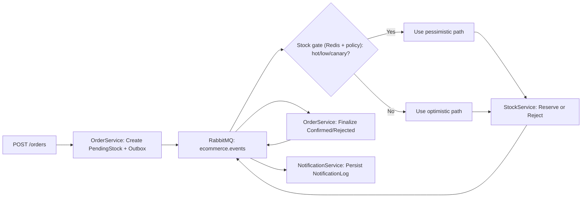

# ShopNGo

<p align="center">
  
</p>


[](https://github.com/cangiremir/shopngo/actions/workflows/ci.yml)


Reliability-first commerce orchestration platform for event-driven order fulfillment.

## Quick Navigation

- [One-Minute Pitch](#one-minute-pitch)
- [Architecture Snapshot](#architecture-snapshot)
- [How to Run and Verify](#how-to-run-and-verify)
- [Live URLs](#live-urls)
- [Reliability Drills](#reliability-drills)

## One-Minute Pitch

`ShopNGo` is a modular commerce engine that keeps order lifecycle decisions correct, observable, and recoverable under real-world failure conditions.

What this platform delivers:

- **Correctness:** deterministic order finalization, no silent message loss
- **Reliability:** retry + DLQ + replay drills for controlled recovery
- **Observability:** traces, metrics, logs, alerts, and runbook triage
- **Scalability posture:** throughput profiles, idempotent consumers, bounded service ownership

## Architecture Snapshot

### Services

- `Order`: API, saga starter, finalization logic
- `Stock`: reservation authority and stock consistency
- `Notification`: channel dispatch and idempotent notification log

### Infra

- `RabbitMQ` with retry/DLQ topology
- `PostgreSQL` (database-per-service)
- `Redis` for stock guardrail (hot-SKU detection + admission control)
- `OpenTelemetry + Jaeger`
- `Prometheus + Grafana + Alertmanager + Loki`

### Flow



## Why This Design

| Decision                    | Why it matters                                     |
| --------------------------- | -------------------------------------------------- |
| Database-per-service        | Clear ownership and fault isolation                |
| Outbox/Inbox                | Avoids dual-write inconsistency                    |
| At-least-once + idempotency | Practical reliability under broker/network faults  |
| Retry + DLQ + replay        | Separates transient failures from operator actions |
| Observability stack in repo | Reliability claims are directly testable           |

## Live URLs

- Order API: `http://localhost:8081/swagger`
- Stock API: `http://localhost:8082/swagger`
- Notification API: `http://localhost:8083/swagger`
- RabbitMQ UI: `http://localhost:15672` (`guest`/`guest`)
- Jaeger UI: `http://localhost:16686`
- Prometheus: `http://localhost:9090`
- Grafana: `http://localhost:3000` (`admin`/`admin`)
- Alertmanager: `http://localhost:9093`

## How to Run and Verify

1. Start platform:

```bash
docker compose up -d --build
```

2. Run one end-to-end scenario:

For a standard end-to-end flow, run:

```powershell
pwsh ./platform/scenarios/run-e2e.ps1
```

For the SMS notification flow, run:

```powershell
pwsh ./platform/scenarios/run-e2e.ps1 -NotificationChannel sms -CustomerPhone +15551234567
```

For the rejection flow (insufficient stock), run:

```powershell
pwsh ./platform/scenarios/run-e2e.ps1 -SeedQty 1 -OrderQty 2 -ExpectedStatus Rejected
```

For a heavier stock/reservation flow, run:

```powershell
pwsh ./platform/scenarios/run-e2e.ps1 -OrderQty 1 -SeedQty 50
```

3. Evidence checklist:

- `run-e2e.ps1` exits successfully and follows this output pattern:
  ```text
  ✅ Stock seeded
  ✅ Order terminal status: Confirmed|Rejected
  ✅ Notification log found
  🎉 E2E scenario passed.
  ```
- RabbitMQ UI shows retry/DLQ queues under control (`*.retry`, `*.dlq`)
- Jaeger UI shows cross-service trace for the order lifecycle
- Grafana dashboard shows activity on API/message/queue panels during the run

## Reliability Drills

Run these on a live local system to inject controlled failures and verify resilience end-to-end.

1. Poison message to DLQ: Simulates malformed events and validates retry-to-DLQ behavior.

```powershell
pwsh ./platform/chaos/01-poison-message-dlq.ps1
```

2. RabbitMQ outage and outbox recovery: Simulates broker downtime and verifies outbox replay after recovery.

```powershell
pwsh ./platform/chaos/02-rabbitmq-outage-outbox-recovery.ps1
```

3. Stock DB outage to retry/DLQ: Simulates stock persistence outage and validates retry, DLQ, and recovery path.

```powershell
pwsh ./platform/chaos/03-stock-db-outage-retry-dlq.ps1
```

4. Duplicate delivery idempotency: Sends duplicate integration messages and verifies single notification side-effect.

```powershell
pwsh ./platform/chaos/04-duplicate-delivery-idempotency.ps1
```

5. DLQ replay utility: Replays a DLQ message back to `ecommerce.events` for operational recovery.

```powershell
pwsh ./platform/chaos/05-dlq-replay.ps1
```

Runbook: `docs/runbooks/operational-reliability.md`
